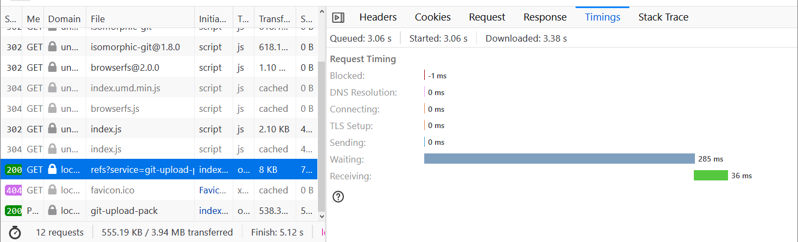
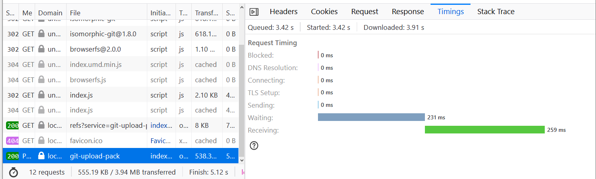
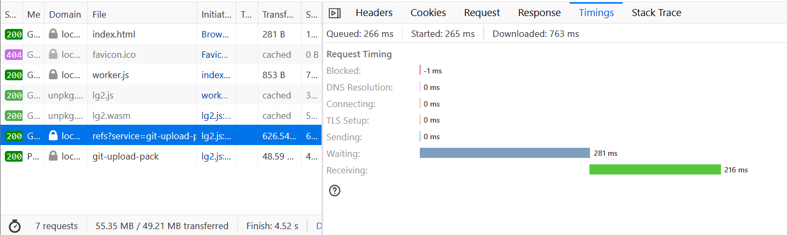
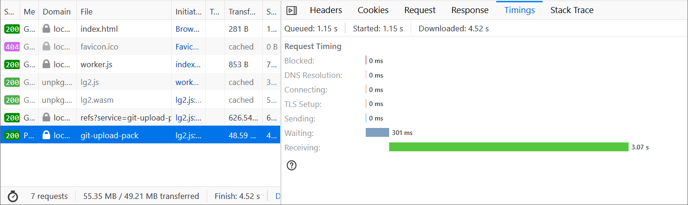

LibGit2 is unable to do shallow clone:

[https://github.com/libgit2/libgit2/issues/3058](https://github.com/libgit2/libgit2/issues/3058)

These comparisons were made using unmodified versions of `isomorphic-git@0.8.0` and `wasm-git@0.0.4` without using shallow cloning for either

# Full Cloning

## Real World

**Testing against: [https://github.com/gothinkster/react-redux-realworld-example-app](https://github.com/gothinkster/react-redux-realworld-example-app)**

**Using local proxy for CORS issues**

- LibGit2 (In-memory)
    - Time-to-clone: Consistently ~1.8/1.7 seconds
    - 2 requests
    
- Isomorphic-git (indexeddb)
    - Time-to-clone: ~2s (similar chrome/ff)
    - 2 requests

** Requests **

929ms for both network requests (chunked)

## NextJS

**Testing against: [https://github.com/vercel/next.js](https://github.com/vercel/next.js)**

**Using local proxy for CORS issues**

- LibGit2 (in memory)
    - Time-to-clone: ~46s
    - 2 requests

- Isomorphic-git (indexeddb) (similar results to in-memory)
    - Time-to-clone: ~147s (firefox) ~108s (Chrome)
    - 2 requests

** Requests **

