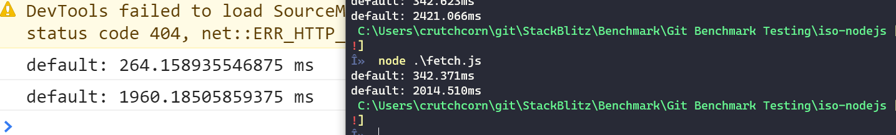

# Full Cloning

LibGit2 is unable to do shallow clone:

[https://github.com/libgit2/libgit2/issues/3058](https://github.com/libgit2/libgit2/issues/3058)

These comparisons were made using unmodified versions of `isomorphic-git@0.8.0` and `wasm-git@0.0.4` without using shallow cloning for either

`isomorphic-git` utilized BrowserJS's in-memory storage, while `wasm-git` utilized Emscripten's MEMFS, to try to keep things apples-to-apples

## Real World

**Testing against: [https://github.com/gothinkster/react-redux-realworld-example-app](https://github.com/gothinkster/react-redux-realworld-example-app)**

**Using local proxy for CORS issues**

- LibGit2 (In-memory)
    - Time-to-clone: Consistently ~1.8/1.7 seconds
    - 2 requests
    
- Isomorphic-git (indexeddb)
    - Time-to-clone: ~2s (similar chrome/ff)
    - 2 requests

** Requests **

929ms for both network requests (chunked)

## NextJS

**Testing against: [https://github.com/vercel/next.js](https://github.com/vercel/next.js)**

**Using local proxy for CORS issues**

- LibGit2 (in memory)
    - Time-to-clone: ~46s
    - 2 requests

- Isomorphic-git (indexeddb) (similar results to in-memory)
    - Time-to-clone: ~147s (firefox) ~108s (Chrome)
    - 2 requests

** Requests **

### Shallow Clone

- Isomorphic-git (in-memory) (shallow-clone)
    - Time-to-clone: ~53 (FF) ~40s (chrome)

** Requests **

# Fetch Objects Only

In order to run `fetch` only (without `checkout`, but without any mods to `fetch`), it took `isomorphic-git` 80s

This makes me think that `fetch` also has expensive operations when it comes to expanding the packfile

Once `modified-iso-demo` did an early return to prevent packfile expansion, this went down to 2s. This makes me think we should
do _only_ the request on `isomorphic-git`, and do all of the packfile extraction in Rust

## Comparison of `isomorphic-git` Node vs Web

Because of the immense time difference of `10s` (iso-git on Node) vs `150s` (iso-git in Firefox), we wanted to make sure that the browser and Node were making requests at the same speed
and the only major difference in speed was parsing that data

This comparison only uses `isomorphic-git/http/web` vs `ismorphic-git/http/node` and requests both files directly

The node version of the code lives under [`./iso-nodejs/fetch.js`](./iso-nodejs/fetch.js) while the browser version lives under [`./fetch-iso-demo-browser`](./fetch-iso-demo-browser)

There seems to be negligable/no difference in the timing of the network request, only parsing

## Comparison of `nodegit` vs `isomorphic-git`

`nodegit` (Unlimited depth, no single-branch)

https://github.com/nodegit/nodegit/issues/1669

» node .\server.js
default: 23883.927ms

`isomorphic-git` (Depth 1, single branch)

» node .\server.js
default: 14232.943ms